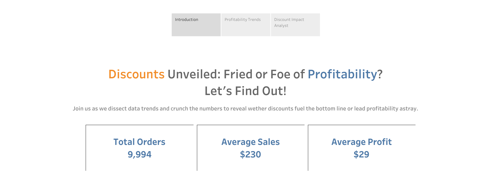

# <h1> Superstore Discount Analysis </h>

#### Introduction:
As part of the "Creating Dashboards and Storytelling with Tableau" course in Coursera, I've created an analysis to answer a business question:

Are discounted orders more or less profitable than non-discounted orders? 

#### Project Scope:
This Story Points presentation effectively answers the business question by presenting a clear narrative supported by well-designed visualizations. 
It aligns with the board's needs for actionable insights and demonstrates the impact of discounts on profitability. 
The design choices reflect the specific needs of the audience, ensuring a compelling and informative presentation for the stakeholders.

####
<a href="https://public.tableau.com/app/profile/reishsier.abonita/viz/SuperstoreDiscountAnalysis_16929256562840/SuperstoreDiscountAnalysis"></img></a>
####
<a href="https://public.tableau.com/app/profile/reishsier.abonita/viz/SuperstoreDiscountAnalysis_16929256562840/SuperstoreDiscountAnalysis"></img></a>
####
<a href="https://public.tableau.com/app/profile/reishsier.abonita/viz/SuperstoreDiscountAnalysis_16929256562840/SuperstoreDiscountAnalysis"></img></a>

#### Who It's For:
Crafted for the company's board members, the key decision-makers. It's designed to deliver clear findings and actionable recommendations from the "Superstore Discount Analysis.
#### Design Choice:
To strike a balance between minimalism and informative content, I chose a design approach rooted in Gestalt principles. 
This ensures easy understanding, even for non-technical individuals. 
The motivation behind this lies in recognizing the importance of delivering clear insights to key decision-makers – the company's board members.
